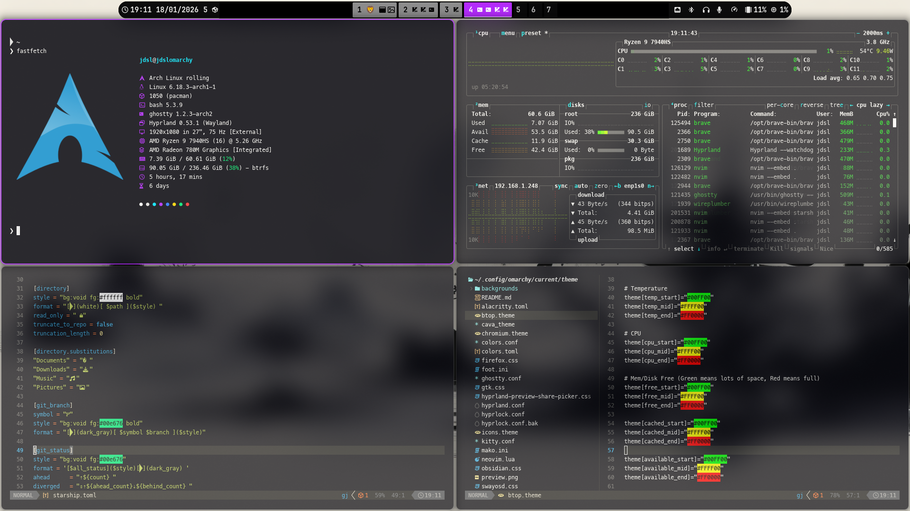

# Black Poison - Omarchy Theme

A dead simple theme for the digital minimalist with just the necessary colors to easily recognize stuff. (Inspired by Felix & Black_Arch theme).



## Installation

### Automated Installation
To install this theme using the Omarchy Theme installer:

```sh
omarchy-theme-install https://github.com/DanielLob-o/omarchy-black-poison.git
```

### Manual Installation

Clone the repository:
```sh
git clone https://github.com/DanielLob-o/omarchy-black-poison.git
cd omarchy-black-poison
```

### Configuration Details

Copy the relevant files to your configuration directories. Backup your existing configs before replacing them!

#### Window Manager & Lock Screen
* **Hyprland**: `cp hyprland.conf ~/.config/hypr/hyprland.conf`
* **Hyprlock**: `cp hyprlock.conf ~/.config/hypr/hyprlock.conf`
* **Waybar**: 
  ```sh
  # Backup existing
  cp -r ~/.config/waybar ~/.config/waybar.backup
  # Install new
  cp -r waybar/* ~/.config/waybar/
  ```
  *Dependencies*: `ttf-font-awesome`, `wttrbar`, `waybar-module-pacman-updates-git` (AUR)

#### Terminals
* **Alacritty**: `cp alacritty.toml ~/.config/alacritty/alacritty.toml`
* **Kitty**: `cp kitty.conf ~/.config/kitty/kitty.conf`
* **Foot**: `cp foot.ini ~/.config/foot/foot.ini`
* **Ghostty**: `cp ghostty.conf ~/.config/ghostty/config`

#### Shell & Prompt
* **Starship**:
  ```sh
  cp starship/starship.toml ~/.config/starship.toml
  ```
* **Fastfetch**:
  ```sh
  cp -r fastfetch/fastfetch ~/.config/fastfetch
  ```

#### Editors
* **Neovim**: `cp neovim.lua ~/.config/nvim/init.lua`
* **VS Code**:
  * Settings: Import `vscode.json`
  * Theme: Import `vscode_colors.json`

#### Other Applications
* **Btop**: `cp btop.theme ~/.config/btop/themes/black_poison.theme`
* **Cava**: `cp cava_theme ~/.config/cava/config`
* **Mako** (Notifications): `cp mako.ini ~/.config/mako/config`
* **SwayOSD**: `cp swayosd.css ~/.config/swayosd/style.css`
* **Walker**: `cp walker.css ~/.config/walker/style.css`
* **Discord/Vencord**: Use `vencord.theme.css` in your Vencord settings.
* **Firefox**: Copy `firefox.css` to your `chrome/userChrome.css`.
* **Chromium**: Use `chromium.theme`.

#### System Theme
* **GTK**: `cp gtk.css ~/.config/gtk-3.0/gtk.css`
* **Icons**: `icons.theme`

## Color Palette Verification

You can verify the theme colors using the included script:

```sh
./tester.sh
```

## Credits

Inspired by Felix & Black_Arch theme.